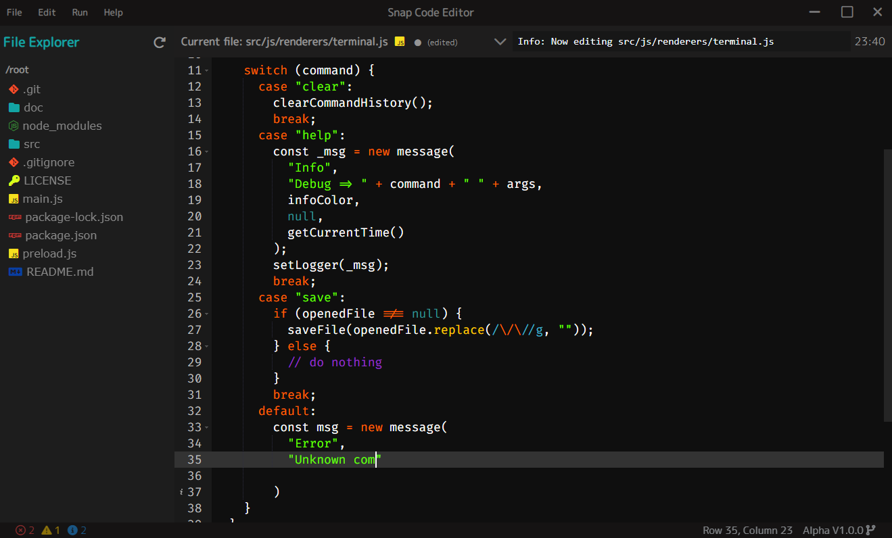

# Snap Code Editor

> I am working on this project to learn Electron framework. The best way to learn something is accomplished by actually using it.

## Stack

- [Electron](https://www.electronjs.org/) - Build cross-platform desktop apps with JavaScript, HTML, and CSS
- [Ace](https://ace.c9.io/) - Ace is an embeddable code editor written in JavaScript

## License

MIT License

Check out [LICENSE](./LICENSE) for more detail.
